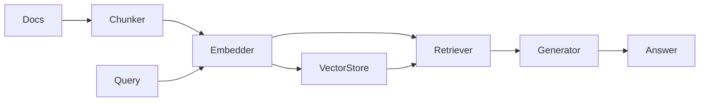

# rag-platform

A small, typed **RAG platform**: chunk → embed → retrieve → answer, plus a hit-rate eval.

Shows the retrieval loop as real code, not a notebook demo. Small surface area — readable in one sitting.

## Why this exists

Shipping RAG means a clear pipeline, not a slide deck. This repo answers with readable code:

1. Chunk documents (window + overlap)
2. Embed with a pluggable `Embedder`
3. Store + search vectors (in-memory cosine)
4. Build an answer from top-k context
5. Measure retrieval with top-k hit rate

Tests and the example use a deterministic `HashingEmbedder` — no API keys, no model downloads.

## Architecture



## Quickstart

```bash
npm install
npm test
npm run example
```

```ts
import { HashingEmbedder, RagPipeline } from "@aadiaiagent/rag-platform";

const rag = new RagPipeline(new HashingEmbedder());
await rag.ingest([{ id: "1", text: "RAG retrieves context before answering." }]);
const { answer, citations } = await rag.ask("What is RAG?");
```

## Design choices

- **Mock-first embeddings** — CI stays offline; swap in OpenAI/Voyage later via `Embedder`
- **Explicit chunking params** — no magic splitters buried in deps
- **Measurable retrieval** — `evaluateRetrieval` returns hit rate, not vibes
- **Small surface area** — readable in one sitting

## Layout

```
src/chunking/      Document chunking
src/embeddings/    Embedder interface + HashingEmbedder
src/vectorstore/   In-memory cosine store
src/retrieval/     Top-k retriever
src/chat/          RagPipeline + answer generator
src/eval/          Hit-rate evaluation
examples/          End-to-end demo
fixtures/          Sample docs
```

## Roadmap

- [ ] Persistent vector backends (SQLite / Postgres pgvector)
- [ ] Hybrid BM25 + dense retrieval
- [ ] Reranking stage
- [ ] Groundedness checks on answers

## License

MIT
